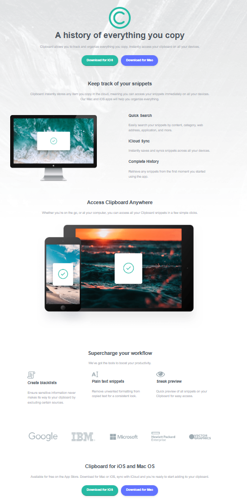

# Frontend Mentor - Clipboard landing page solution

This is a solution to the [Clipboard landing page challenge on Frontend Mentor](https://www.frontendmentor.io/challenges/clipboard-landing-page-5cc9bccd6c4c91111378ecb9). Frontend Mentor challenges help you improve your coding skills by building realistic projects. 

## Table of contents

- [Overview](#overview)
  - [The challenge](#the-challenge)
  - [Screenshot](#screenshot)
  - [Links](#links)
- [My process](#my-process)
  - [Built with](#built-with)
  - [What I learned](#what-i-learned)
  - [Continued development](#continued-development)
  - [Useful resources](#useful-resources)
- [Author](#author)
- [Acknowledgments](#acknowledgments)


## Overview

This project is a modern, responsive landing page for "Clipboard," a fictional productivity application that allows users to track and organize their snippets across all devices. The design is clean and professional, focusing on clear calls to action and a feature-rich layout.

### The challenge

Users should be able to:

- View the optimal layout for the site depending on their device's screen size
- See hover states for all interactive elements on the page

### Screenshot




### Links

- Solution URL: [Frontend Mentor Solution]()
- Live Site URL: [Live Demo]()

## My process

### Built with

- Semantic HTML5 markup
- CSS custom properties
- Flexbox
- CSS Grid
- Mobile-first workflow

### What I learned

This project allowed me to practice advanced responsive layouts using CSS Grid. I particularly focused on the footer section, where I used a multi-column grid layout that adapts to screen sizes.

I also learned how to use CSS filters to change the color of SVG icons on hover, which is a great way to handle hover states without needing multiple assets:

```css
.socials a:hover img {
  filter: invert(59%) sepia(52%) saturate(464%) hue-rotate(121deg) brightness(91%) contrast(89%);
  transform: scale(1.1);
}
```

Implementation of CSS variables for a consistent theme:

```css
:root {
  --strong-cyan: hsl(171, 66%, 44%);
  --light-blue: hsl(233, 100%, 69%);
  --dark-grayish-blue: hsl(210, 10%, 33%);
  --grayish-blue: hsl(201, 11%, 66%);
}
```

### Continued development

In future projects, I want to further explore:
- Advanced CSS Grid techniques like `grid-template-areas`.
- Improving accessibility with better ARIA labels.
- Implementing CSS-only animations for smoother user interactions.

### Useful resources

- [CSS-Tricks - A Complete Guide to Grid](https://css-tricks.com/snippets/css/complete-guide-grid/) - This is my go-to reference for anything Grid-related.
- [MDN Web Docs - CSS filter](https://developer.mozilla.org/en-US/docs/Web/CSS/filter) - Helped me understand how to apply color changes to icons programmatically.


## Author

- Frontend Mentor - [@GuillainWise](https://www.frontendmentor.io/profile/GuillainWise)
- Twitter - [@yourusername](https://www.twitter.com/yourusername)

## Acknowledgments


This was a solo project completed as part of the Frontend Mentor challenges.
